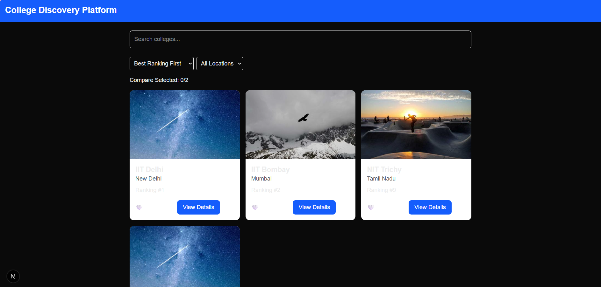
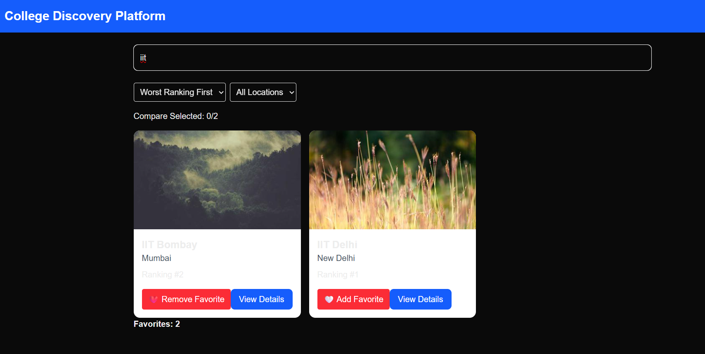
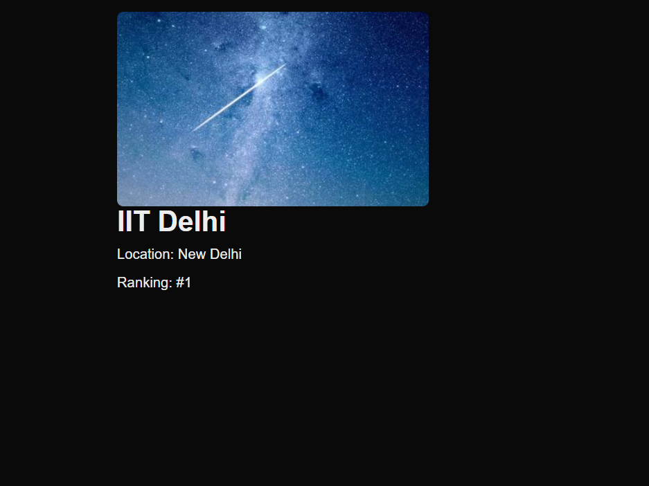

# 🎓 College Discovery Platform

A responsive web application built using **Next.js**, **React**, **TypeScript**, and **Tailwind CSS** that helps users explore and discover colleges.

## 🚀 Features

* Search colleges by name
* Filter colleges by location
* Sort colleges by ranking
* Add and remove favorites
* Persistent favorites using Local Storage
* Dynamic college details page
* Responsive design for mobile and desktop
* API-based data fetching

## 🛠️ Tech Stack

* Next.js
* React
* TypeScript
* Tailwind CSS
* Git & GitHub

## 🚀 Live Demo

[https://your-project.vercel.app](https://college-discovery-platform12.vercel.app/)

## 📸 Screenshots

### Home Page



### Search & Filter



### College Details



## 📦 Installation

Clone the repository:

```bash
git clone https://github.com/pratima-dev25/college-discovery-platform.git
```

Go to the project folder:

```bash
cd college-discovery-platform
```

Install dependencies:

```bash
npm install
```

Run the development server:

```bash
npm run dev
```

Open:

```text
http://localhost:3000
```

## 🎯 What I Learned

* React component architecture
* State management with Hooks
* Dynamic routing in Next.js
* API integration
* TypeScript fundamentals
* Responsive UI development
* Version control with Git and GitHub

## 🔮 Future Improvements

* User authentication
* College comparison feature
* Database integration
* Real college dataset
* Admin dashboard

## 👩‍💻 Author

**Pratima Kumari**

Aspiring Software Engineer | BCA Student
